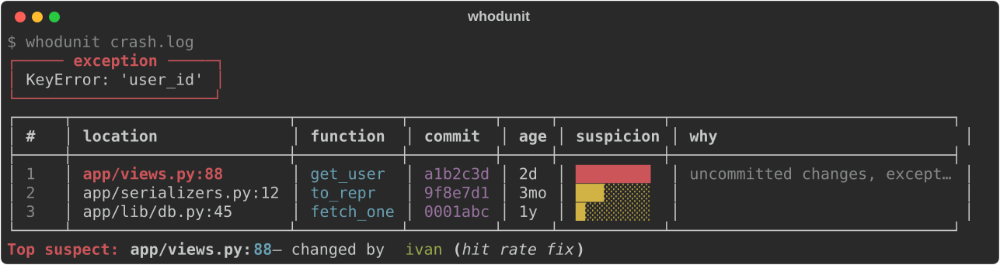

<p align="center">
  <h1 align="center">🔍 whodunit</h1>
  <p align="center">tiny cli that reads a python traceback, runs <code>git blame</code> on every frame<br>and tells you who (and what commit) probably broke it</p>
  <p align="center">
    <a href="https://github.com/Saa1001zp/whodunit/actions/workflows/test.yml"></a>
    
    
    
    
  </p>
</p>

<p align="center">
  
  <br>
  <em>reads a traceback, sorts every frame by how suspicious it is, points at the culprit</em>
</p>

---

### why i built this

reading a traceback from prod is annoying. the last line says `KeyError`, but there are 8 frames from 8 files and no clue which one just changed.

so this tool takes a traceback, runs `git blame` on every frame and sorts them by suspicion: how recent the change is, whether the file has uncommitted edits, how often the file churns, how close the frame is to the exception.

> the last line that raised the error is usually not the last line that changed.

built it in a couple evenings for my portfolio. simple on purpose, no over engineering.

<p align="center">

| 🎯 find the culprit | 🧠 explainable score | 🔌 zero setup |
|---|---|---|
| git blame on every frame | weights you can tune in `.env` | clone, install, run |

</p>

---

### how it works

```
traceback text
      |
 1. parser      -> frames (file:line, function) + final exception
 2. git blame   -> commit, author, age, dirty?, churn per frame
 3. score       -> w_recency * freshness
                 + w_dirty   * uncommitted
                 + w_churn   * file churn
                 + w_depth   * closeness to the exception
 4. render      -> sorted table + top suspect  (or --json)
```

- **parser** - plain regex, no deps. handles chained exceptions (`raise ... from`), 3.11+ carets and SyntaxError frames
- **git blame** - `git blame --porcelain -L N,N` per frame, cached so we never blame the same line twice
- **graceful** - no git / not a repo / untracked file / path from another machine -> marked `unknown`, nothing crashes

---

### stack

<p>

- **cli** `typer` `rich`
- **git** `subprocess` (no gitpython, just shelling out)
- **config** `pydantic-settings` (weights from `.env`)
- **tests** `pytest` `ruff`

</p>

nothing fancy, just glued what works.

---

### quick start

**1. install**

```bash
git clone https://github.com/Saa1001zp/whodunit
cd whodunit
pip install -r requirements.txt
```

**2. run**

```bash
# from a file
whodunit crash.log

# from stdin
cat crash.log | whodunit
python -m app < crash.log

# straight from your clipboard (perfect for pasting a traceback)
whodunit --clipboard

# json for scripts
whodunit crash.log --json

# only the top 3, no colors
whodunit crash.log --top 3 --no-color
```

**3. what you get**

```
$ whodunit crash.log
┌───── exception ─────┐
│ KeyError: 'user_id' │
└─────────────────────┘
┌─────┬──────────────────┬───────────┬─────────┬─────┬────────────┬────────────────────┐
│   # │ location         │ function  │ commit  │ age │ suspicion  │ why                │
├─────┼──────────────────┼───────────┼─────────┼─────┼────────────┼────────────────────┤
│   1 │ app/views.py:88  │ get_user  │ a1b2c3d │  2d │ ████████   │ edit in work..     │
│   2 │ app/serial..py:12│ to_repr   │ 9f8e7d1 │ 3mo │ ███░░░░░   │ hot file (14..     │
│   3 │ app/lib/db.py:45 │ fetch_one │ 0001abc │  1y │ ░░░░░░░░   │                    │
└─────┴──────────────────┴───────────┴─────────┴─────┴────────────┴────────────────────┘
Top suspect: app/views.py:88 — changed by ivan (hit rate fix)
```

---

### config

everything via `.env`

```ini
WHODUNIT_MAX_FRAMES=30          # don't print a wall of frames
WHODUNIT_W_RECENCY=1.0          # fresh change = suspicious
WHODUNIT_W_DIRTY=2.0            # uncommitted edits weigh a lot
WHODUNIT_W_CHURN=0.5            # files that change often
WHODUNIT_W_DEPTH=0.7            # closer to the exception = more suspicious
WHODUNIT_RECENCY_DECAY_DAYS=30  # freshness half-life
WHODUNIT_CHURN_COMMITS=20       # look at last N commits of the file
WHODUNIT_CHURN_REF=10           # N commits = 100% churn
WHODUNIT_GIT_TIMEOUT=10
```

---

### how the score works

```
score = w_recency * 0.5 ** (age_days / decay)
      + w_dirty   * (1 if uncommitted else 0)
      + w_churn   * min(1, commits_in_window / churn_ref)
      + w_depth   * depth            # 0.0 first frame ... 1.0 exception point
```

it is intentionally dumb and explainable. every reason shows up in the `why` column:

```
uncommitted edits, exception point, hot file (14 commits), changed 2d ago
```

so you can argue with it, not just trust it.

---

### tests

```bash
pytest -v              # 25 tests
make test
```

parser tests run on real tracebacks (chained, syntax, carets, `<stdin>`). repo tests spin up a throwaway git repo with pinned commit dates so blame is deterministic.

---

### structure

```
app/main.py      # typer cli, flags
app/parser.py    # traceback text -> frames
app/repo.py      # git blame/status/log, cached, graceful fallback
app/score.py     # pure scoring function
app/render.py    # rich table + --json
app/config.py    # weights from .env
tests/           # 25 tests
scripts/generate_demo.py   # draws docs/demo.svg
```

---

### make

```
make install   deps
make run       cli help
make test      tests
make lint      ruff
make demo      redraw docs/demo.svg
make clean     clean caches
```

---

### whats next

- [x] git blame on every frame
- [x] json output
- [x] clipboard input
- [ ] `--since` to only look at recent commits
- [ ] blame the diff, not just the line
- [ ] show `git log` of the suspect commit

open an issue if you want to help.

---

### license

MIT - do what you want.

next time prod breaks, let it blame someone for you.

if you like it give it a star :) feedback welcome - Sanya
